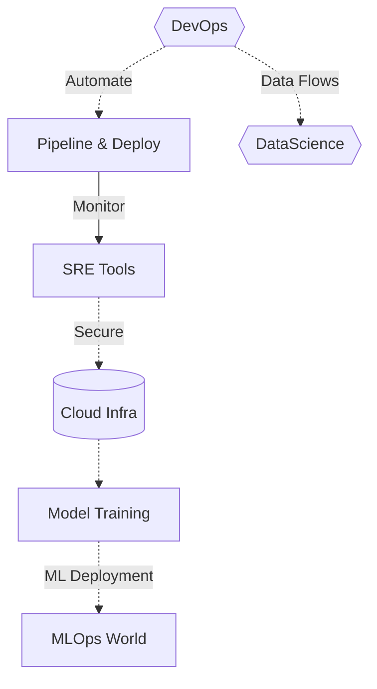

<!-- 🚀 Modern Animated Header | DevOps x Data Science | MLOps Enthusiast -->

  

  <!-- You can personalize these GIFs or replace with custom SVGs for maximum uniqueness -->
  
  

<h1 align="center">Hi, I'm Shubham! </h1>

  <b>🚀 DevOps Engineer</b> | <b>📈 Data Science Explorer</b> | <b>⚡ MLOps Dreamer</b>

---

## 🧬 My Tech Story: Automating + Innovating Across Stacks

- **DevOps DNA**: Bash scripts at midnight, CI/CD pipelines that deploy like magic, infra that stays up even after my coffee runs out.
- **Data Science Vibes**: ML models that try (and sometimes fail), Python explorations, messy data—turned meaningful!
- **Creative Mindset**: Every solution should be funky, fast, and fun to hack.
- **MLOps Ambitions**: Seamless synergy between infrastructure and intelligence.

---

## 💡 Toolbox of the Modern Era

<!-- Skill badges: DevOps -->

<!-- Skill badges: Data Science -->

<!-- Skill badges: Other tools -->

---

## ⚡ Highlight Reel

- Turned 15+ boring deployments into single-click magic 🎩.
- Tamed microservices and tamed data pipelines (almost never at the same time).
- Cat-wrangled YAML, Dockerfiles, and the occasional ML model, with infra that just won’t quit.
- Made monitoring fun (with slick dashboards, alert memes, and lots of automation).
- My mantra: **If I can automate it, I will. If not, I learn how.**

---

## 🔥 GitHub Dashboard — Fully Animated

  
  
   
  

---

### ⚡ Automation Fun Facts

> "Did you know? The first DevOps engineer probably automated making coffee alongside deploys. I like to think my pipelines do both."
>
> "Fact: Every data scientist spends 80% of their time cleaning data. The other 20%? Automating the cleaning for next time."
>
> "When my pipelines break, I call it 'creative chaos.' It's just automation asking for attention."
>
> "My favorite deployment status: 'Success after one tiny fix.' That fix? Usually a missing semicolon."
>
> "The best pipeline is like a good joke—if you have to explain it, you should probably rewrite it."

---

## ⚙️ Current Lab Experiments

- Building versatile, self-healing DevOps pipelines
- Architecting cloud infrastructure for flexible ML model deployment
- Data wrangling & exploratory ML in Python (sometimes with pizza)
- Researching MLOps edge cases (and memes for fun)

---

## 📡 Connect With Me

  
  

---

## 🌈 Final Thought

> Pipelines are like puzzles; ML is like magic.  
> Every new tool is a party, and every new problem is an invitation.  
> Trying to make tech more fun, fast, and fail-proof—one commit at a time.

---

  
   
  <i>Modern DevOps + DataScience by Shubham Saini</i>

